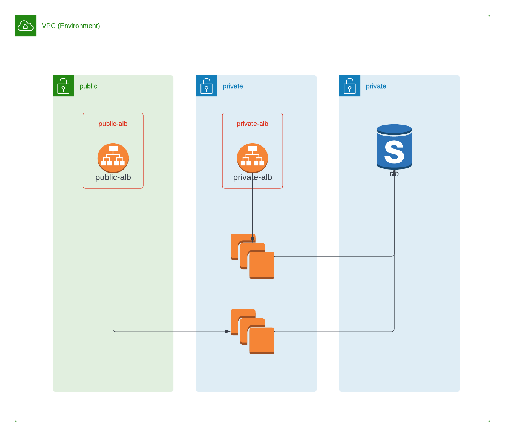

# Network

This terraform builds a VPC with the best practices available from Amazon.

3 subnets. `public`, `private` and `database` with security groups that only allow the ALB to connect to the instances.

## Diagram

